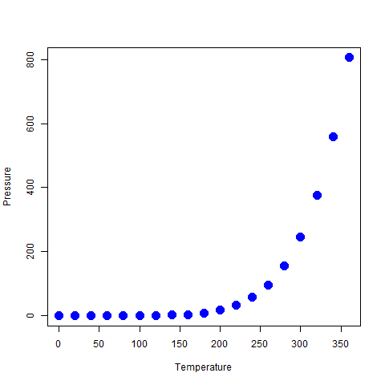

# Install the necessary packages
To work efficiently with rmarkdown you will need the `rmarkdown` package, as well as the `tinytex` package to knit (translate) the .rmd file to .pdf. 


# Getting started with markdown

Create a new R Markdown document in RStudio by clicking on `File` -\> `New File` -\> `R Markdown...`. Choose the output format and click `OK`. This will create a new R Markdown document with the following YAML header (Yet Another Metadata Language) .

The YAML header is where you specify the metadata of your document, such as the title, author, and date. You can also specify the output format, bibliography, and citation style. The YAML header is enclosed by three dashes `---` at the beginning and end of the header. You can also do further in-text customisation using HTML and CSS code.

# Basics of working in markdown

Here is how you write a comment in rmarkdown:

<!-- This is a comment -->

Comments are not rendered in the final document.

You can use either the source code or the visual editor to write markdown. Each has its own advantages and disadvantages: for basic layout tasks, you can use the visual editor and, for more advanced tasks, you can use the source code editor.

The Help menu in RStudio provides a Markdown Quick Reference guide that you can use to learn the basics of markdown. You can also have a look at a more comprehensive guide [here][<https://bookdown.org/yihui/rmarkdown/>].

In markdown, you can embed code chunks using three backticks followed by the language, e.g. letter `r` for R, and three backticks at the end of the code chunk. You can also simply click on the small green square at the top of the window to insert a code chunk.

```{r setup, include = FALSE, echo = FALSE}
library(tidyverse)
library(here)
library(renv)
library(grateful)
library(trackdown)
```

These chunks have several options, such as `include`, `echo`, and `eval`, that allow you to control whether the code is included in the output, whether the code is displayed, and whether the code is executed, respectively. Note you can name (or not) the code chunks.

```{r cars F, include = FALSE, echo = FALSE}
summary(cars)
```

```{r cars T, include = TRUE, echo = TRUE}
summary(cars)
```

You can render the document by clicking the `Knit` button in RStudio. This will generate the output document in the specified format. You can also use the ctrl/cmd + shift + k shortcut.

# Figures

There are two ways you can include figures in an R Markdown document: from file or embedded.

## Embedded figures with code chunks.

```{r pressure, echo = TRUE}
plot(pressure, 
     pch = 19, 
     col = "blue", 
     cex = 2,
     xlab = "Temperature",
     ylab = "Pressure")
```

## Figures from file

For figures from file, you can use the `![]` syntax followed by the path to the image file.



# Tables

You can easily knit tables in R Markdown using the `knitr::kable()` function, which has several functions to customise the table.

```{r, echo = TRUE}
knitr::kable(head(iris),
             caption = "This is a table")
```

```{r, echo = TRUE}
knitr::kable(head(iris),
             align = "l",
             caption = "This is also a table")
```

# Equations

Maybe unsurprisingly so, you can also include equations in R Markdown using LaTeX syntax. For inline equations, you can use single dollar signs `$` and for display equations, you can use double dollar signs `$$`. Here are a few examples, inline $x = y$ vs. display, appearing in a different line $$x = y$$.

$$\int_{a}^{b}$$

$$\psi \Psi$$

$$\sum_{x = a}^{b} f(x)$$

# References

## General

Including references in R Markdown is easy. You can include a bibliography (.bib) in the YAML header and then cite references in the text using `[@key]`. To do so, go to visual mode and click on the `Insert` button, then `Citation`. For example, one of my favourite papers is [@layman2023] If I take out the `[]` I can cite them directly as subject in the sentence: @layman2023 wrote one of my favourite papers.

To change the citation style, you can specify the CSL file in the YAML header. For example, I am using the Ecology Letters style (line 9), but you could use a different link or refer to a local file.

By default, the references will be displayed at the end of the document. If you want it somewhere else, use the following line of code where you want the reference list to go.

::: {#refs}
:::

## The `grateful` package

The `grateful` package allows you to easily cite the packages you used in your analysis. To gather all the citations in bibliography format, you can use the `grateful::cite_packages()` function, specifying where you want the .bib file to go.

You can also include the same function with `output = "paragraph"` to have a paragraph listing R and all packages with version. Alternatively, you can cite them one by one in the main text.

```{r, echo = TRUE}
grateful::cite_packages(output = "paragraph", out.dir = ".")
```

Note that you will have to link your .rmd file to the grateful .bib file in the YAML header, in addition to the .bib from your other references, as shown in lines 6-8 of the present document.

# But what if you want a specific format for the document?

Maybe you want to save time by directly having a template for your manuscript. The `rticles` package provides journal templates that you can use to format your document. To use the package, you can install it from CRAN and then when you create a new R Markdown document, you can select the template you want to use from the 'From template' menu option.

# The `trackdown` package

The `trackdown` package allows you to connect your Rstudio with Google Drive to easily track the versions of your files. You can upload, update, and download files from a remote repository. For example, you can upload your manuscript to a remote repository by using the `trackdown::upload_file()` function. You can also update the file by using the `trackdown::update_file()` function. Finally, you can download the file by using the `trackdown::download_file()` function, which will incorporate edits and comments from coauthors. Only the main author will need a Google account to use the package.

## Let's experiment! Have a try at some of the riddles below

### What word contains 26 letters but only has three syllables?

### I sometimes run, but I can’t walk. What am I?

### Where did the viruses go?

### Also try to comment some random chunks of the text
